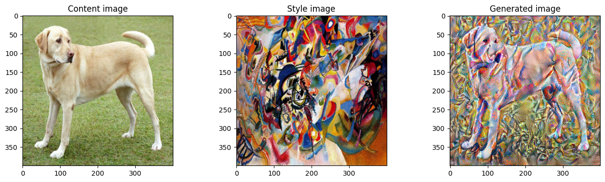

# DeepArt

This repo contains implementation of model that generate novel artistic images using Neural Style transfer Algorithm by [Gatys et al. (2015).](https://arxiv.org/abs/1508.06576).

- It uses representations (hidden layer activations) based on a pretrained ConvNet.
- The content cost function is computed using one hidden layer's activations.
- The style cost function for one layer is computed using the Gram matrix of that layer's activations. The overall style cost function is obtained using several hidden layers.
- Optimizing the total cost function results in synthesizing new images.

- 
Colab Notebook

  

## References

The Neural Style Transfer algorithm was due to Gatys et al. (2015).
The pre-trained network used in this implementation is a VGG network, which is due to Simonyan and Zisserman (2015). Pre-trained weights were from the work of the MathConvNet team.

- Leon A. Gatys, Alexander S. Ecker, Matthias Bethge, (2015). [A Neural Algorithm of Artistic Style](https://arxiv.org/abs/1508.06576)
- Karen Simonyan and Andrew Zisserman (2015). [Very deep convolutional networks for large-scale image recognition](https://arxiv.org/pdf/1409.1556.pdf) [MatConvNet.](http://www.vlfeat.org/matconvnet/pretrained/)
